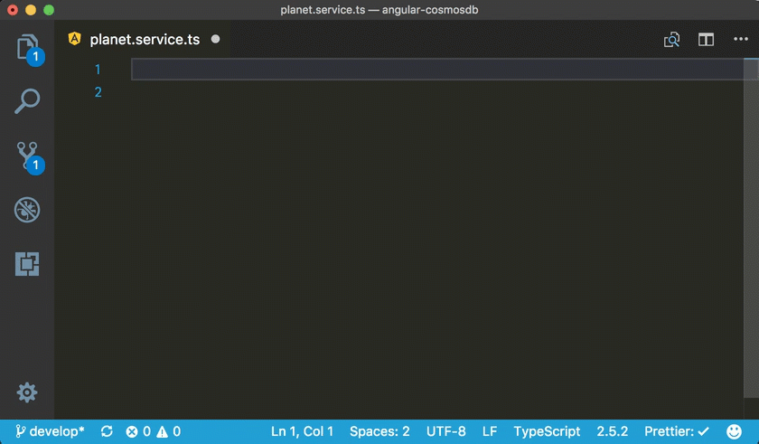
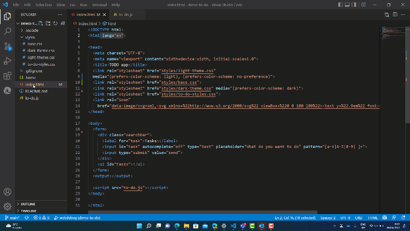

<h1> 📖 Documentación📖 </h1>

Bienvenidos a este proyecto dedicado a la documentación sobre **Angular** con **Material UI**.

Este proyecto esta hecho con la finalidad que entre la comunidad de **GIT** consigamos tener la mejor documentación hispanohablante dedicada a estos **Frameworks**. 


<h1>  Índice <h1>

- [Introducción](#introducción)
  - [TypeScript](#typescript)
  - [Angular](#angular)
  - [Angular Material](#angular-material)
    - [Conclusión](#conclusión)
- [Prepara tu entorno](#prepara-tu-entorno)
  - [NODE.JS y NPM](#nodejs-y-npm)
    - [Que es NODE](#que-es-node)
    - [Que es NPM](#que-es-npm)
    - [Instalar NODE](#instalar-node)
  - [Editor de codigo](#editor-de-codigo)
    - [1. Angular Snippets](#1-angular-snippets)
    - [2. Angular Language Service](#2-angular-language-service)
    - [3. Angular Console](#3-angular-console)
    - [4. Chrome \& Edge Debugger](#4-chrome--edge-debugger)
    - [5. Prettier](#5-prettier)
    - [6. Material Icon Theme](#6-material-icon-theme)
    - [7. Path Intellisense](#7-path-intellisense)
    - [8. Auto Import](#8-auto-import)
    - [9. Peacock](#9-peacock)
    - [10. Angular Schematics](#10-angular-schematics)
  - [Instalar GIT](#instalar-git)
  - [Clonar repositorio](#clonar-repositorio)
  - [Primer arranque](#primer-arranque)
    - [Instalación de las dependencias](#instalación-de-las-dependencias)
    - [Arranque del servidor de desarrollo](#arranque-del-servidor-de-desarrollo)
    - [Construcción del proyecto](#construcción-del-proyecto)
    - [Ayuda adicional](#ayuda-adicional)
- [Typescript](#typescript-1)
  - [Que es Typescript](#que-es-typescript)
- [Angular](#angular-1)
  - [Que es Angular](#que-es-angular)

# Introducción

## TypeScript 

**TypeScript** es un superconjunto de JavaScript que añade tipos estáticos a la lengua. Los tipos proporcionan una forma de describir la forma de un objeto, proporcionando una mejor documentación y permitiendo a TypeScript validar que tu código está funcionando correctamente. Esto hace que el código sea más fácil de entender y menos propenso a errores. TypeScript es especialmente útil en proyectos grandes y complejos donde la seguridad de los tipos puede ayudar a prevenir errores difíciles de detectar.

## Angular

**Angular** es un marco de trabajo desarrollado y mantenido por Google para la construcción de aplicaciones web de una sola página (SPA). Angular ha revolucionado el desarrollo web con su enfoque basado en componentes. En lugar de construir una aplicación web como un código monolítico, Angular permite a los desarrolladores construir aplicaciones como un conjunto de componentes reutilizables. Cada componente en Angular tiene su propia lógica y vista, lo que facilita la gestión y el mantenimiento del código. Además, Angular viene con una serie de características poderosas, como enrutamiento, gestión del estado, formularios reactivos, pruebas unitarias y de extremo a extremo, que hacen que el desarrollo de aplicaciones complejas sea más manejable.

## Angular Material

**Angular Material** es una biblioteca de componentes de interfaz de usuario (UI) para Angular. Proporciona un conjunto de componentes de UI preconstruidos que siguen los principios del Material Design de Google. Estos componentes ayudan a los desarrolladores a construir interfaces de usuario consistentes y atractivas para las aplicaciones Angular sin tener que crear cada componente desde cero. Angular Material también se integra perfectamente con Angular, lo que permite a los desarrolladores aprovechar todas las características de Angular al trabajar con Angular Material.

### Conclusión 

Juntos, **TypeScript**,  **Angular** y **Angular Material** forman una combinación poderosa para el desarrollo web. Esta guía te llevará a través de los conceptos básicos de estas tecnologías, desde la instalación hasta la creación de tu primera aplicación Angular con Angular Material y TypeScript. A lo largo del camino, aprenderás sobre los conceptos clave de Angular, cómo crear y estilizar componentes con Angular Material, y cómo aprovechar el poder de TypeScript en tus proyectos de Angular.


# Prepara tu entorno

## NODE.JS y NPM

### Que es NODE

**Node.js** es un entorno en tiempo de ejecución de JavaScript. Este entorno permite a los desarrolladores crear toda clase de herramientas de lado servidor y aplicaciones en JavaScript. Node.js fue creado por los desarrolladores originales de JavaScript y transformó JavaScript de algo que solo podía ejecutarse en el navegador en algo que se podría ejecutar en los ordenadores como si de aplicaciones independientes se tratara. Node.js se ejecuta en el motor de tiempo de ejecución JavaScript V8, que es el motor de JavaScript que alimenta Google Chrome. Este motor toma el código JavaScript y lo convierte en un código de máquina más rápido.

---

### Que es NPM

NPM, que significa "Node Package Manager", es el administrador de paquetes predeterminado para el tiempo de ejecución de JavaScript Node.js.

NPM tiene dos partes principales:
1. Una herramienta CLI (interfaz de línea de comandos) para la publicación y descarga de paquetes.
2. Un repositorio en línea que alberga paquetes de JavaScript.

NPM permite a los desarrolladores de JavaScript compartir paquetes útiles de forma rápida y fácil. En el momento de escribir este post, ¡npm ha facilitado la publicación de más de 1.3 millones de paquetes con una tasa de descarga semanal de más de 16 mil millones!

Además, cada proyecto en JavaScript puede ser enfocado como un paquete npm con su propia información de paquete y su archivo `package.json` para describir el proyecto. Este archivo se generará cuando se ejecute `npm init` para inicializar un proyecto JavaScript/Node.js.

---

### Instalar NODE

1. **Abre la página de descarga de Node.js**. Ve a `nodejs.org` en el navegador web de tu computadora.

2. **Haz clic en la opción Current ("Actual")**. Es un cuadro verde en la parte derecha de la página. Hacerlo hará que se descargue el archivo de configuración de Node.js en la computadora.

3. **Haz doble clic en el archivo de configuración**. Lo encontrarás en la carpeta de descargas predeterminada de la computadora.

4. **Haz clic en Siguiente**. Se encuentra en la parte inferior de la ventana de configuración.

5. **Marca la casilla de "Acepto"**. La encontrarás debajo de los términos de uso.

6. **Haz clic en Siguiente**. Se encuentra en la parte inferior de la ventana.

7. **Especifica una ubicación para la instalación**. En caso de que quieras cambiar la ubicación predeterminada para la instalación (que es C:\\Archivos de programa\\nodejs), haz lo siguiente:
    - Haz clic en Cambiar... debajo de la ruta de instalación actual.
    - Haz clic en el cuadro desplegable de "Buscar".
    - Haz clic en Archivos de programa.
    - Selecciona la carpeta en la que quieras instalar Node.js.
    - Haz clic en ACEPTAR.

8. **Haz clic dos veces en Siguiente**. Se encuentra en la parte inferior de la ventana.

9. **Haz clic en Instalar**. Encontrarás esta opción en la parte inferior de la ventana. Node.js comenzará a instalarse.

10. **Haz clic en Terminado cuando se te pida**. En este momento, se habrá instalado Node.js. Podrás comprobar que la instalación se haya realizado con éxito usando el "Símbolo del sistema".

Para probar la instalación, puedes seguir estos pasos:

1. **Abre Inicio**. Haz clic en el logotipo de Windows en la esquina inferior izquierda de la pantalla.

2. **Busca el "Símbolo del sistema"**. Escribe símbolo del sistema para hacerlo.

3. **Haz clic en Símbolo del sistema**. Se encuentra en la parte superior del menú "Inicio". Al hacerlo se abrirá la ventana de "Símbolo del sistema".

4. **Introduce el comando "versión"**. Escribe `node -v` y presiona Intro. Se te saludará con un mensaje con el texto "v Número" donde "Número" será el número de versión del programa Node.js que hayas descargado.

5. **Instala un paquete en caso de que sea necesario**. Si quieres probar la habilidad de Node.js para instalar un paquete, escribe `npm install -g http-server` en el "Símbolo del sistema" y presiona Intro. Aparecerá una barra de progreso en el "Símbolo del sistema", y la extensión "http-server" se instalará en la carpeta de instalación de Node.js.

Si tienes problemas con la instalación, puedes intentar restaurar Node.js de la siguiente manera:

- Abre la carpeta de instalación.
- Busca la carpeta "nodejs" y bórrala.
- Haz doble clic en el archivo de instalación de Node.js para reiniciar la instalación.
- Usa la configuración predeterminada para instalar Node.js.

---

## Editor de codigo

Lo primero de todo es tener instalado un editor de código **(vscode, eclipse, notepad++, Sublime Text, etc)** en el cual podamos ejecutar y probar nuestro código.
En nuestro caso usaremos vscode, pues a consideración personal es el mas completo junto con sus extensiones para **Angular**.
Recomiendo estas extensiones:

### 1. Angular Snippets
Esta extensión proporciona fragmentos de código para Angular en TypeScript y HTML. Los fragmentos de código son pequeñas piezas de código reutilizables que puedes insertar en tu código, lo que te ahorra tiempo de escritura y reduce la posibilidad de errores. Los fragmentos incluyen componentes, servicios, módulos, guardias, interceptores HTTP, rutas, entre otros.

- `https://marketplace.visualstudio.com/items?itemName=johnpapa.Angular2`



### 2. Angular Language Service
Esta extensión mejora la experiencia de edición para las plantillas de Angular. Proporciona listas de finalización, que son sugerencias de código que aparecen mientras escribes, mensajes de diagnóstico, que son alertas sobre problemas en tu código, y la funcionalidad de "ir a la definición", que te permite saltar directamente a donde se define una variable o función.

- `https://marketplace.visualstudio.com/items?itemName=Angular.ng-template`

### 3. Angular Console
Esta extensión ayuda a los desarrolladores a evitar la necesidad de buscar documentación de comandos de CLI raramente utilizados proporcionando autocompletado. Esto significa que mientras escribes un comando, la extensión te sugerirá posibles completaciones basadas en lo que has escrito hasta ahora. También facilita la navegación por esquemas personalizados, la búsqueda e instalación de nuevos plugins Nx, y la generación consistente de componentes, servicios y módulos de gestión de estado de Angular.

- `https://marketplace.visualstudio.com/items?itemName=nrwl.angular-console`

### 4. Chrome & Edge Debugger
Esta extensión permite a los desarrolladores depurar su código JavaScript directamente desde Visual Studio Code. La depuración es el proceso de encontrar y corregir errores en tu código. Con esta extensión, puedes establecer puntos de interrupción en tu código desde Visual Studio Code, lo que te permite detener la ejecución de tu código en puntos específicos y examinar los valores de las variables en ese momento.

- `https://marketplace.visualstudio.com/items?itemName=ms-edgedevtools.vscode-edge-devtools`



### 5. Prettier
Prettier es una extensión que formatea automáticamente tu código. El formateo del código es el proceso de hacer que el código sea más legible y consistente en términos de estilo, como la indentación, el espaciado y la colocación de las llaves. Prettier puede configurarse para formatear automáticamente tu código cada vez que guardas un archivo, lo que ayuda a mantener un estilo de código coherente en todo el proyecto.

- `https://marketplace.visualstudio.com/items?itemName=esbenp.prettier-vscode`

### 6. Material Icon Theme
Esta extensión proporciona una amplia gama de iconos de archivos y carpetas, lo que facilita la identificación visual de los tipos de archivos en tu proyecto. Por ejemplo, los archivos JavaScript pueden tener un icono de una pequeña "J", mientras que los archivos HTML pueden tener un icono de una pequeña "H".

- `https://marketplace.visualstudio.com/items?itemName=PKief.material-icon-theme`

### 7. Path Intellisense
Esta extensión proporciona autocompletado inteligente para las rutas de archivos en tu código. Esto significa que mientras escribes la ruta a un archivo, la extensión te sugerirá posibles completaciones basadas en los nombres de los archivos y las carpetas en tu proyecto. Esto puede ayudar a prevenir errores tipográficos y garantizar la precisión al hacer referencia a archivos o módulos dentro de tu proyecto.

- `https://marketplace.visualstudio.com/items?itemName=christian-kohler.path-intellisense`


### 8. Auto Import
Esta extensión proporciona acciones de código y finalización de código para todas las importaciones disponibles. En JavaScript y TypeScript, a menudo necesitas importar funciones, objetos o valores de otros archivos o módulos. Esta extensión puede sugerirte automáticamente estas importaciones mientras escribes tu código, y puede insertarlas por ti cuando las seleccionas.

- `https://marketplace.visualstudio.com/items?itemName=steoates.autoimport`

### 9. Peacock
Esta extensión cambia sutilmente el color de tu espacio de trabajo de Visual Studio Code. Esto puede ser útil cuando tienes varias instancias de VS Code abiertas y quieres poder identificar rápidamente cuál es cuál.

- `https://marketplace.visualstudio.com/items?itemName=johnpapa.vscode-peacock`

### 10. Angular Schematics
Esta extensión te permite generar código Angular con unos pocos clics. Se basa en la CLI de Angular y utiliza los mismos esquemas que la CLI. Los esquemas son plantillas de código que puedes personalizar para generar componentes, servicios, módulos y otras piezas de código de Angular.

- `https://marketplace.visualstudio.com/items?itemName=cyrilletuzi.angular-schematics`
  
  

---

## Instalar GIT

- <h3>Paso 1: Descargar Git</h3>
Primero, necesitas descargar el instalador de Git. Puedes hacerlo desde la página oficial de Git en `https://git-scm.com/download/win`. Una vez que estés en la página, la descarga debería comenzar automáticamente. Si no es así, puedes hacer clic en el enlace "click here to download manually".

- <h3>Paso 2: Iniciar el instalador</h3>
Una vez que el instalador de Git se haya descargado, ve a la carpeta de descargas y haz doble clic en el archivo `.exe` para iniciar el instalador.

- <h3>Paso 3: Aceptar la licencia</h3>
Aparecerá una ventana con la licencia de Git. Es importante que leas y comprendas los términos antes de continuar. Si estás de acuerdo con los términos, haz clic en el botón que dice "Next" para aceptar los términos y continuar con la instalación.

- <h3>Paso 4: Seleccionar la ubicación de instalación</h3>
A continuación, selecciona la carpeta donde deseas instalar Git. Por defecto, Git se instala en la carpeta `C:\Program Files\Git`. Si quieres cambiar la ubicación, puedes hacerlo en este paso. Una vez que hayas seleccionado la carpeta, haz clic en "Next".

- <h3>Paso 5: Seleccionar componentes</h3>
En la siguiente pantalla, puedes elegir los componentes que deseas instalar. Asegúrate de tener seleccionada la opción "Windows Explorer integration", que te permitirá usar Git desde el menú contextual del Explorador de Windows. También puedes seleccionar otras opciones según tus necesidades. Una vez que hayas seleccionado los componentes, haz clic en "Next".

- <h3>Paso 6: Elegir el editor de texto predeterminado</h3>
Git te permite elegir tu editor de texto preferido. Por defecto, Git usa Vim, pero puedes cambiarlo a otro editor si lo prefieres. Selecciona el editor que prefieras de la lista y haz clic en "Next".

- <h3>Paso 7: Ajustar tu PATH</h3>
En esta pantalla, te recomendamos seleccionar la opción "Use Git from the Windows Command Prompt". Esto te permitirá usar Git desde la línea de comandos de Windows. Si prefieres usar Git Bash, puedes seleccionar la opción "Use Git Bash only". Una vez que hayas hecho tu selección, haz clic en "Next".

- <h3>Paso 8: Configurar el manejo de línea de fin de archivo</h3>
Git puede manejar automáticamente el cambio de línea de fin de archivo entre Windows y Unix. Te recomendamos seleccionar la opción "Checkout Windows-style, commit Unix-style line endings". Esto convertirá las líneas de fin de archivo a estilo Windows cuando clones un repositorio, y las convertirá de nuevo a estilo Unix cuando hagas commit. Haz clic en "Next" para continuar.

- <h3>Paso 9: Configurar el emulador de terminal</h3>
Git te permite elegir el emulador de terminal que prefieras. Te recomendamos seleccionar la opción "Use MinTTY (the default terminal of MSYS2)", que proporciona una experiencia de terminal más rica. Haz clic en "Next" para continuar.

- <h3>Paso 10: Configurar opciones extra</h3>
En la pantalla de opciones extra, puedes dejar las opciones predeterminadas. Estas incluyen habilitar el almacenamiento de credenciales para que no tengas que introducir tu nombre de usuario y contraseña cada vez que hagas push a un repositorio remoto. Haz clic en "Next" para continuar.

- <h3>Paso 11: Instalar</h3>
Finalmente, haz clic en el botón "Install" para comenzar la instalación. Este proceso puede tardar unos minutos. Una vez que la instalación esté completa, haz clic en "Finish".

¡Eso es todo! Ahora deberías tener Git instalado en Windows. Para comprobar que la instalación fue exitosa, puedes abrir una ventana de comandos y escribir `git --version`. Esto debería mostrarte la versión de Git que acabas de instalar.

---

## Clonar repositorio

<h3>Paso 1: Encuentra el repositorio que quieres clonar</h3>
  
 Primero, necesitas encontrar el repositorio que quieres clonar. Esto puede ser cualquier repositorio que esté alojado en una plataforma que soporte Git, como GitHub, GitLab o Bitbucket. Cuando encuentres el repositorio, busca un botón o enlace que diga "Clone" o "Clonar". Este botón te dará la URL del repositorio, que necesitarás para el siguiente paso. Asegúrate de copiar esta URL.

 `https://github.com/FranJRR/Docs-ESP.git`

<h3>Paso 2: Abre la terminal en tu computadora</h3>
  
 Ahora que tienes la URL del repositorio, necesitas abrir la terminal en tu computadora. La terminal es una interfaz de línea de comandos que te permite interactuar con tu sistema operativo y con aplicaciones como Git. Puedes abrir la terminal buscándola en el menú de inicio de tu sistema operativo o usando un atajo de teclado.

<h3>Paso 3: Navega hasta el directorio donde quieres clonar el repositorio</h3>
  
 Antes de clonar el repositorio, debes decidir dónde quieres que se guarde en tu computadora. Puedes elegir cualquier directorio que quieras. Una vez que hayas decidido, necesitas navegar hasta ese directorio en la terminal. Puedes hacer esto usando el comando `cd`, seguido del nombre del directorio. Por ejemplo, si quieres navegar a un directorio llamado "Proyectos", escribirías `cd Proyectos` en la terminal y luego presionarías Enter.

<h3>Paso 4: Clona el repositorio</h3>
  
 Ahora estás listo para clonar el repositorio. Para hacer esto, escribe el comando `git clone` en la terminal, seguido de la URL del repositorio que copiaste en el primer paso. Debería verse así: `git clone https://github.com/FranJRR/Docs-ESP.git`. Luego, presiona Enter.

<h3>Paso 5: Espera mientras Git clona el repositorio</h3>

 Después de presionar Enter, Git comenzará a clonar el repositorio en tu directorio local. Dependiendo del tamaño del repositorio, esto puede tardar unos segundos o varios minutos. Mientras Git está clonando el repositorio, puedes ver el progreso en la terminal.

<h3>Paso 6: Verifica que el repositorio se haya clonado correctamente</h3>

 Una vez que Git haya terminado de clonar el repositorio, puedes verificar que todo haya funcionado correctamente. Para hacer esto, puedes usar el comando `ls` en la terminal para listar los archivos y directorios en tu directorio actual. Deberías ver un nuevo directorio con el mismo nombre que el repositorio que acabas de clonar. Si entras en ese directorio (`cd Docs-ESP`), deberías ver todos los archivos y directorios del repositorio.

<h3>Paso 7: Comienza a trabajar en el repositorio</h3>

Ahora que has clonado el repositorio, puedes comenzar a trabajar en él. Cualquier cambio que hagas en los archivos del repositorio se rastreará en Git, lo que te permite guardar diferentes versiones de tu código y colaborar con otros.

---

## Primer arranque

### Instalación de las dependencias

Una vez que hayas clonado el repositorio, el siguiente paso es instalar todas las dependencias necesarias. Estas dependencias están definidas en el archivo `package.json` que se encuentra en la raíz del proyecto.

Para instalar las dependencias, abre una terminal y navega hasta la carpeta del proyecto `Docs-ESP`. Una vez allí, ejecuta el siguiente comando:

```bash
npm install 
```

Este comando instalará todas las dependencias necesarias para el proyecto.

### Arranque del servidor de desarrollo

Ahora que todas las dependencias están instaladas, puedes iniciar el servidor de desarrollo. Para hacerlo, ejecuta el siguiente comando en la terminal:

```bash
ng serve
```

Este comando arrancará el servidor de desarrollo de Angular. Una vez que el servidor esté en marcha, podrás ver tu aplicación en acción.

Abre un navegador y visita `http://localhost:4200/`. La aplicación se recargará automáticamente si cambias alguno de los archivos fuente.

### Construcción del proyecto

Si quieres construir el proyecto para producción, puedes hacerlo ejecutando el siguiente comando:

```bash
ng build --prod
```

Este comando construirá el proyecto para producción y colocará los archivos resultantes en la carpeta `dist/`.

### Ayuda adicional

Si necesitas más ayuda con Angular CLI, puedes ejecutar `ng help` en la terminal para obtener más información. También puedes visitar el [Angular CLI README](https://github.com/angular/angular-cli/blob/master/README.md) para obtener una guía más detallada.

# Typescript

## Que es Typescript

**TypeScript** es un lenguaje de programación de alto nivel y de código abierto. Fue desarrollado por Microsoft y lanzado en octubre de 2012. TypeScript es un superconjunto de JavaScript, lo que significa que incluye todas las características de JavaScript y añade otras nuevas.

Aquí están algunas de las principales características de TypeScript:

1. **Tipado estático**: TypeScript introduce el tipado estático, lo que significa que el tipo de las variables se comprueba durante la compilación y no en la ejecución. Esto permite a los desarrolladores especificar los tipos de variables, parámetros de función y valores de retorno, lo que ayuda a detectar errores relacionados con el tipo durante el desarrollo.

2. **Compatibilidad con JavaScript**: TypeScript es compatible con todo el código JavaScript existente. Puede emplear este tipo de código sin problemas y también su sintaxis. Esto es posible porque TypeScript compila en JavaScript nativo.

3. **Orientado a objetos**: TypeScript posee una gran variedad de mecanismos destinados a la programación orientada a objetos, lo que resulta especialmente útil en el desarrollo de aplicaciones de gran tamaño.

4. **Detección temprana de errores**: TypeScript es muy eficaz a la hora de detectar errores y bugs en el código JavaScript antes de la ejecución, lo que hace que el código sea mucho más fiable.

5. **Desarrollo de aplicaciones a gran escala**: TypeScript fue diseñado para el desarrollo de aplicaciones a gran escala y permite trabajar de manera estructurada.

# Angular

## Que es Angular

**Angular** es un **framework** de desarrollo de software de código abierto mantenido por **Google**. Es una plataforma de desarrollo que se utiliza para crear aplicaciones **web de una sola página(SPA)**. Una aplicación **SPA** significa que todo el contenido de la aplicación se carga en una sola página web, lo que mejora la experiencia del usuario.

Angular está escrito en **TypeScript**, un superconjunto de **JavaScript** que proporciona tipos estáticos. Los tipos estáticos ayudan a prevenir errores y a mejorar la legibilidad del código.

Angular proporciona una serie de características y funcionalidades que facilitan el desarrollo de aplicaciones web complejas. Estas características incluyen:

- **Componentes:**  Los componentes son la unidad básica de construcción de aplicaciones Angular. Cada componente es responsable de una parte específica de la interfaz de usuario.
- **Directivas:** Las directivas son elementos HTML personalizados que se utilizan para agregar funcionalidad a la interfaz de usuario.
- **Pipes:** Los pipes se utilizan para formatear datos.
- **Routing:** El enrutamiento (routing) permite a los usuarios navegar entre diferentes partes de una aplicación.
- **Servicios:** Los servicios se utilizan para almacenar datos y realizar operaciones.


<!-- 
-  -->

